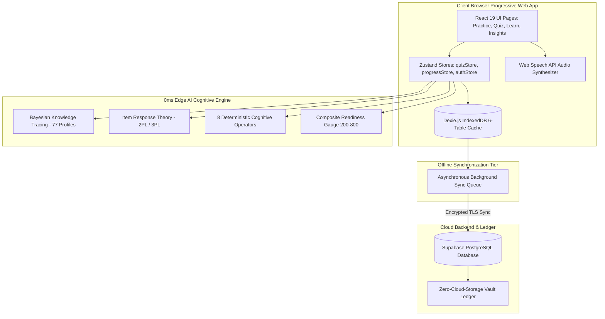

<p align="center">
  
</p>

<h1 align="center">AxonPass — Neural Certification Mastery Engine</h1>

<p align="center">
  <strong>Enterprise-Grade Offline-First Psychometrics & Edge Cognitive Intelligence Platform</strong>
</p>

<p align="center">
  <a href="https://github.com/albertasakiso/AxonPass/actions"></a>
  <a href="https://www.typescriptlang.org/"></a>
  <a href="https://react.dev/"></a>
  <a href="https://vitejs.dev/"></a>
  <a href="https://supabase.com/"></a>
  <a href="https://dexie.org/"></a>
  <a href="#psychometric-modeling--mathematical-engines"></a>
  <a href="#zero-cloud-storage-compliance"></a>
</p>

---

## 📌 Executive Overview

**AxonPass** (by SectorFusion Labs) is an enterprise-grade, privacy-first, offline-ready adaptive learning platform engineered to condition IT audit, cybersecurity, and cloud engineering candidates for grueling global examinations.

Traditional certification prep tools rely on static textbook PDFs and expensive cloud LLM APIs ($12,000–$25,000/yr for study cohorts) with high latency (2–5s per question) and no data privacy guarantees. **AxonPass solves this by executing deterministic psychometric evaluation and cognitive reasoning directly in the browser with 0ms latency**, using Bayesian Knowledge Tracing (BKT), Item Response Theory (IRT 2PL/3PL), and an offline knowledge graph with 338 semantic nodes.

---

## 🎯 15 Supported Global Certification Tracks

AxonPass includes deep, verified curricula across **15 authoritative certification bodies**:

| Certification Code | Official Body | Syllabus Version & Focus | Questions | Chapters | Case Studies |
| :--- | :--- | :--- | :--- | :--- | :--- |
| **CISA** | ISACA | 28th Edition (IT Audit, Governance, Systems Acquisition) | 5,000 | 6 | 5 |
| **CISM** | ISACA | 16th Edition (Security Governance, Incident Management) | 5,000 | 8 | 4 |
| **CRISC** | ISACA | Risk Identification, Assessment, Response & Mitigation | 5,000 | 6 | 4 |
| **CGEIT** | ISACA | Governance of Enterprise IT & Strategic Management | 5,000 | 8 | 4 |
| **CISSP** | ISC2 | 2024 Common Body of Knowledge (8 CBK Domains) | 5,000 | 21 | 8 |
| **CCSP** | ISC2 | Cloud Security Architecture, Operations & Legal | 5,000 | 8 | 6 |
| **ISC2 CC** | ISC2 | Certified in Cybersecurity Entry Foundations | 5,000 | 5 | 5 |
| **AWS SAA-C03** | Amazon Web Services | Solutions Architect Associate (Well-Architected Framework) | 5,000 | 10 | 4 |
| **NIST CSF 2.0** | NIST / US Dept of Commerce | Cybersecurity Framework 2.0 (Govern, Identify, Protect, etc.) | 5,000 | 6 | 5 |
| **GRC** | Open Compliance / ISO | Governance, Risk Management & Compliance Frameworks | 5,000 | 4 | 4 |
| **CompTIA CySA+** | CompTIA | CS0-003 Cybersecurity Analyst Threat Intelligence & SOAR | 5,000 | 5 | 5 |
| **CompTIA Security+** | CompTIA | SY0-701 Security Operations & Threat Vulnerability | 5,000 | 5 | 5 |
| **CompTIA Network+** | CompTIA | N10-008/009 Networking Architecture & Troubleshooting | 5,000 | 5 | 5 |
| **CompTIA A+** | CompTIA | 220-1101 / 1102 Core Hardware & Operating Environments | 5,000 | 9 | 9 |
| **GSLC** | GIAC | GIAC Security Leadership Certification (Policy & Management) | 5,000 | 4 | 4 |
| **FIFA-AGENT** | FIFA | Football Agent Regulations, Transfer Matching System & Ethics | 5,000 | 7 | 5 |

> **Audit Totals:** 15 Tracks &bull; 352 Source Documents (1.80 GB raw, 1,022,515 chunks) &bull; **75,000 Verified Practice Questions** &bull; **112 Master Chapters** &bull; **869 Canonical Glossary Terms** &bull; **77 Case Scenarios**.

---

## ⚡ Core Platform Capabilities

### 1. 0ms Edge Cognitive Reasoning Matrix (`src/lib/ml/explainerEngine.ts`)
Executes an offline deterministic inference engine powered by **8 Cognitive Operators**:
- **Hierarchical Elimination:** Filters distractors that are subordinate to root governance policies.
- **Risk Precedence:** Evaluates decisions against enterprise risk appetite.
- **ISACA Gold Standard Rule:** Enforces board and executive management alignment before operational execution.
- **Root Cause Deduction:** Distinguishes underlying technical deficiencies from superficial symptoms.
- **Scope Verification:** Flags choices exceeding audit, architectural, or charter boundaries.
- **Materiality Boundary:** Calibrates financial, operational, or legal impact thresholds.
- **Compensating Control Alignment:** Validates secondary controls when Segregation of Duties (SoD) cannot be achieved.
- **Life Safety First:** Mandates physical human safety over asset availability or data integrity.

### 2. Psychometric Modeling & Mathematical Engines
- **Bayesian Knowledge Tracing (BKT) (`src/lib/ml/bktEngine.ts`):** 4-parameter sequential latent knowledge update ($P(L_0), P(T), P(G), P(S)$) calibrated across 77 domain parameter sets.
- **Item Response Theory (IRT 2PL/3PL) (`src/lib/ml/irtEngine.ts`):** Models candidate latent ability $\theta \in [-3.0, +3.0]$, item discrimination ($a$), item difficulty ($b$), and standard error of measurement ($SEM$).
- **Brier Score Metacognitive Calibration:** Measures subjective probability vs empirical outcome across 5 confidence bins to detect *illusory superiority* and *imposter hesitation*.
- **Scaled Scoring Engine (200–800) (`src/lib/scoring/readinessGauge.ts`):** Converts domain-weighted performance to the official ISACA/Pearson scaled scoring standard with a 450 pass cutscore and 9-tier Gauge to Excellence.
- **5-Box Leitner Spaced-Repetition System (`src/lib/leitner.ts`):** Automatically routes missed items to Box 0 for targeted reinforcement while graduating mastered concepts through Box 5.

### 3. Pearson VUE-Grade Protracted Exam Simulations (`src/pages/QuizPage.tsx`)
- **Endurance Conditioning:** Full 150-question, 4-hour mock simulations timed under Pearson VUE conditions with 15% timer compression pacing (~82s per question vs 96s real).
- **Scheduled Midpoint Breaks:** Automatic unpenalized 10-minute break prompt at the 50% milestone (Question 75 for CISA/CISM, Question 62 for CISSP) with paused exam clocks.
- **Cognitive Fatigue Tracking (`analyzeCognitiveFatigue`):** 4-quartile stamina depletion analytics comparing first-half vs. second-half performance ($\Delta_{\text{Fatigue}}$).
- **Safe Exam Termination:** Clear separation between **Pause Exam**, **Finish Exam**, and a non-destructive **Stop Quiz** modal offering *Grade & View Results* or *Discard & Exit*.
- **Review Timer Protection:** Exam countdown timer automatically freezes whenever the AI Explainer Drawer, Formula Reference Sheet, Review Grid, or Break Modal is open.

### 4. Dual-Mode Document Reader & Audio-Guided E-Reader (`src/components/learn/DocumentReader.tsx`)
- **Dual-Mode Reading:** Switch between structured domain study guides and master ingested manual PDF/chunk views.
- **Web Speech API Speech Engine (`src/lib/audio/speechEngine.ts`):** 100% offline, zero-bandwidth text-to-speech audio reader with real-time waveform animation and active sentence-by-sentence glowing highlights.

### 5. Offline-First PWA & Zero-Storage Architecture
- **6-Table Dexie.js Cache (`src/lib/db.ts`):** Local IndexedDB stores all questions, user progress, quiz sessions, study materials, glossary terms, and offline sync mutations.
- **Bi-Directional Conflict Resolution (`src/lib/syncUserProgress.ts`):** Queues offline exam attempts and reconciles them seamlessly with Supabase PostgreSQL upon reconnection.
- **Zero Cloud Storage Overhead:** Operates with 366 bytes of cloud object storage, saving 100% on recurring cloud storage budgets.

---

## 🏛️ System Architecture



---

## 📂 Project Structure

```
apiliguPass/
├── index.html                  # SEO, Open Graph & Twitter Cards metadata
├── netlify.toml                # Netlify SPA redirect rules and security headers
├── vercel.json                 # Vercel SPA rewrites and cache-control headers
├── vite.config.ts              # Vite + VitePWA service worker build config
├── PROJECT_INTAKE.md           # Formal 21-point project intake specification
├── public/
│   ├── favicon.svg             # Vector neural shield crest favicon
│   ├── manifest.json           # Web App Manifest (PWA)
│   ├── og-image.png            # 1200x675 Open Graph social preview banner
│   ├── twitter-card.png        # 1200x675 Twitter / X summary card banner
│   ├── _redirects              # Netlify fallback routing rule
│   └── icons/                  # 192px, 512px, and Apple Touch icons
├── my_documents/
│   ├── images/                 # High-resolution showcase mockups and blueprints
│   │   ├── hero-image-1920x1080.png
│   │   ├── mobile-pwa-showcase-1080x1920.png
│   │   ├── architecture-diagram-1600x900.png
│   │   └── social-sharing-banner-1200x675.png
│   └── [Source Manuals & Documents]
├── src/
│   ├── App.tsx                 # Top-level React Router with zero-trust auth gates
│   ├── main.tsx                # React 19 root entry
│   ├── components/
│   │   ├── common/             # Reusable AxonPassLogo vector component
│   │   ├── layout/             # Header, SideRail, AppShell navigation
│   │   ├── quiz/               # QuestionCard, Timer, AiExplainerDrawer, FormulaDrawer
│   │   ├── learn/              # DocumentReader, AdobeContentReader, AudioControls
│   │   ├── insights/           # CompositeReadinessGauge, RadarCharts, CalibrationCurves
│   │   └── auth/ & profile/    # AuthModal, UserProfileModal, Goal-Setting
│   ├── lib/
│   │   ├── db.ts               # Dexie IndexedDB local database schema
│   │   ├── sync.ts             # Bi-directional Supabase data synchronization
│   │   ├── timer.ts            # Pacing, 15% timer compression, and fatigue analysis
│   │   ├── leitner.ts          # 5-Box Leitner spaced-repetition algorithms
│   │   ├── audio/              # Native Web Speech API speech engine
│   │   ├── ml/                 # BKT, IRT, Edge Cognitive Explainer engines
│   │   └── scoring/            # 200-800 scaled scoring and readiness gauge
│   ├── pages/                  # HomePage, PracticePage, QuizPage, ResultsPage, LearnPage, InsightsPage, AdminPage
│   ├── stores/                 # Zustand stores (quizStore, progressStore, authStore, syncStore)
│   ├── styles/                 # CSS tokens, glassmorphism, responsive styles
│   └── types/                  # TypeScript interface declarations
└── scripts/                    # Verification and curriculum ingestion audit scripts
```

---

## 🚀 Quick Start Guide

### Prerequisites
- **Node.js:** v18.0.0 or later (v20+ recommended)
- **Package Manager:** npm or pnpm

### 1. Clone the Repository
```bash
git clone https://github.com/albertasakiso/AxonPass.git
cd AxonPass
```

### 2. Install Dependencies
```bash
npm install
```

### 3. Environment Configuration
Create a `.env` file in the root directory (refer to `.env.example`):
```env
VITE_SUPABASE_URL=https://your-project.supabase.co
VITE_SUPABASE_ANON_KEY=your-supabase-anon-key
```

### 4. Run Development Server
```bash
npm run dev
```
Open your browser at `http://localhost:5173` to explore the live application.

### 5. Type Diagnostics & Production Build
```bash
# Type check without emitting files
npx tsc --noEmit

# Compile production bundle and generate PWA service worker
npm run build

# Preview production build locally
npm run preview
```

### 6. Verify 100% Ingestion & ML Model Coverage
Execute the automated audit verification script to inspect database coverage across all 15 certification tracks:
```bash
node scripts/verify_100pct_ingestion_and_ml_coverage.js
```

---

## 🌐 Deployment

AxonPass is production-ready for deployment on modern edge hosting platforms:

### Vercel
Configured out of the box via [`vercel.json`](vercel.json):
- Single-page application rewrites to `/index.html`
- 1-year immutable caching on `/assets/*`
- Built-in security headers (`X-Frame-Options: DENY`, `X-Content-Type-Options: nosniff`)

### Netlify
Configured via [`netlify.toml`](netlify.toml) and [`_redirects`](public/_redirects):
- Build command: `npm run build`
- Publish directory: `dist`
- 200 rewrite rule: `/* -> /index.html`

---

## 📊 Visual Mockup Showcase

High-resolution visual assets for portfolio showcases, case studies, and press kits are archived in [`my_documents/images/`](my_documents/images/):

- **Hero Image (1920 × 1080):** `my_documents/images/hero-image-1920x1080.png` — AxonPass Dark Mode Dashboard on an ultra-wide studio display featuring the 742/800 Composite Readiness Gauge and BKT domain radar curves.
- **Mobile PWA Showcase (1080 × 1920):** `my_documents/images/mobile-pwa-showcase-1080x1920.png` — 3-phone carousel displaying live Pearson VUE proctored exam UI, Audio E-Reader with active voice sentence highlighting, and Leitner 5-box progress drawer.
- **Architecture Diagram (1600 × 900):** `my_documents/images/architecture-diagram-1600x900.png` — Offline-first PWA data flow schematic from IndexedDB to Edge ML, Sync Queue, and Supabase cloud ledger.
- **Social Sharing Banner (1200 × 675):** `my_documents/images/social-sharing-banner-1200x675.png` — Official Open Graph card with the holographic neural crest badge.

---

## 👥 Credits & Authorship

Developed by **SectorFusion Labs** (Accra, Ghana).  
- **Lead Enterprise Architect & Full-Stack Lead:** Albert Apuliga Asakiso  
- **Documentation & Specifications:** [`PROJECT_INTAKE.md`](PROJECT_INTAKE.md) &bull; [`TECHNICAL_REQUIREMENTS_SPECIFICATION_ML_ENGINE.md`](TECHNICAL_REQUIREMENTS_SPECIFICATION_ML_ENGINE.md)

---

## 📄 License

This software and its proprietary curriculum ingestion pipelines are protected under private enterprise license. All certification titles and trademarks (CISA, CISM, CRISC, CGEIT, CISSP, CCSP, AWS, NIST, CompTIA, GIAC, FIFA) belong to their respective copyright holders.
