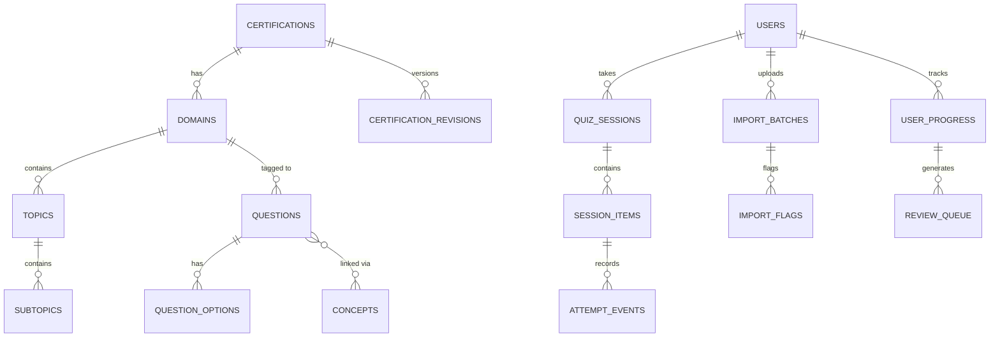

# Apiligu Learning Pass — Implementation Plan

A single-user, offline-first PWA for professional certification mastery. Initial certification: ISACA CISA. Stack: **React + Vite + TypeScript**, **Supabase** (Auth/Postgres/Storage), **Dexie.js** (IndexedDB), **Recharts**, deployed to **Netlify**.

---

## Document Synthesis — Key Decisions Resolved

Your three specification documents overlap in some areas and diverge in others. This plan resolves them into a single coherent build:

| Decision Point | Resolution | Source |
|---|---|---|
| **Framework** | React + Vite (pure client-side SPA) | v2 spec §5.2 — no SSR needed; simpler offline-first |
| **Styling** | Vanilla CSS with design tokens (no Tailwind, no glassmorphism) | v1 spec §7, v2 spec §4.1 |
| **State management** | Zustand | Project Name1 §2.1 |
| **Charts** | Recharts | Project Name1 §3.5 |
| **Offline DB** | Dexie.js (IndexedDB) | All three docs agree |
| **PWA** | vite-plugin-pwa (Workbox) | Project Name1 §2.1 |
| **Hosting** | Netlify (simpler SPA redirects) | v2 spec §5.4 |
| **Timer compression** | `allotted = real_duration × (session_q / total_q) × 0.85` | v2 spec §7.3 |
| **Adaptive engine** | 5-box Leitner system (deterministic, no AI) | v2 spec §7.4 |
| **Primary color** | Royal Blue `#002366` (v1) / `#4169E1` (v2/Project1) | Using `#002366` for headers + `#4169E1` as accent — see design section |
| **Mastery threshold** | 80% across 3 consecutive correct (Box 3+) | Both specs agree |
| **CISSP adaptive** | Ship as fixed-form practice only in v1 | v2 spec §7.3 |
| **Passing score (app)** | 80% (app threshold) — note: real CISA pass = 450/800 | Project Name1 §4 |

---

## User Review Required

> [!IMPORTANT]
> **Supabase Project**: You need to create a Supabase project before Phase 0 can be completed. Do you already have one, or should I guide you through setup?

> [!IMPORTANT]
> **Royal Blue Shade**: Your documents use two different royal blues — `#002366` (darker, v1 spec) and `#4169E1` (brighter, Project Name1). I'll use **`#002366`** as the primary (headers, nav, buttons) and **`#4169E1`** as an accent/hover shade. Please confirm.

> [!IMPORTANT]
> **Typography**: v2 spec proposes two directions — *Option A: Structured Editorial* (serif headings + sans body) vs *Option B: Technical Precision* (geometric sans throughout). I recommend **Option B** with **Space Grotesk** for headings/UI and **Inter** for body text, with **JetBrains Mono** for timers/scores. Please confirm or pick Option A.

> [!WARNING]
> **Content Rights**: The 1,000-question CISA bank will be stored **only in your private Supabase instance** and never bundled into public client assets or shared. You'll be prompted to confirm content rights on first import.

## Open Questions

1. **Netlify vs Vercel** — I'm defaulting to Netlify per v2 spec. Any preference?
2. **Domain name** — Do you have a production domain ready, or will we use the Netlify default URL initially?
3. **Email for auth** — What email address should be the single owner account?

---

## Proposed Changes

### Phase 0 — Foundation (This Session)

Sets up the entire project skeleton: build tooling, design system, routing, Supabase config, Dexie.js offline DB, PWA manifest, and the authenticated app shell.

---

#### [NEW] Project Initialization

```
d:\SECTOR FUSION PROJECTS\apiliguPass\
├── src/
│   ├── main.tsx                    # App entry point
│   ├── App.tsx                     # Root router + auth guard
│   ├── vite-env.d.ts               # Vite type declarations
│   │
│   ├── assets/                     # Static assets (icons, images)
│   │
│   ├── styles/
│   │   ├── index.css               # Design system: tokens, reset, utilities
│   │   ├── components.css          # Reusable component styles
│   │   └── pages.css               # Page-specific overrides
│   │
│   ├── components/
│   │   ├── layout/
│   │   │   ├── AppShell.tsx        # Main layout wrapper (nav + content)
│   │   │   ├── BottomNav.tsx       # Mobile bottom navigation
│   │   │   ├── SideRail.tsx        # Desktop side navigation
│   │   │   └── Header.tsx          # Top bar with sync status
│   │   │
│   │   ├── ui/
│   │   │   ├── Button.tsx          # Primary/secondary/ghost variants
│   │   │   ├── Card.tsx            # Content card with border/shadow
│   │   │   ├── ProgressBar.tsx     # Linear progress indicator
│   │   │   ├── Badge.tsx           # Status badge (draft/published/mastered)
│   │   │   ├── Timer.tsx           # Countdown timer component
│   │   │   ├── Modal.tsx           # Dialog/sheet component
│   │   │   ├── Toast.tsx           # Notification toast
│   │   │   └── SyncIndicator.tsx   # Online/offline/pending status
│   │   │
│   │   ├── quiz/
│   │   │   ├── QuestionCard.tsx    # Single question display
│   │   │   ├── OptionButton.tsx    # Answer option with feedback states
│   │   │   ├── QuizProgress.tsx    # Progress bar + question counter
│   │   │   ├── FlagButton.tsx      # Flag for review
│   │   │   ├── RationalePanel.tsx  # Explanation after answer
│   │   │   └── ReviewGrid.tsx      # Exam review grid (answered/flagged/skipped)
│   │   │
│   │   ├── insights/
│   │   │   ├── RadarChart.tsx      # Domain strength/weakness
│   │   │   ├── AccuracyTrend.tsx   # Line graph over time
│   │   │   ├── StudyHeatmap.tsx    # Activity calendar
│   │   │   └── DomainBreakdown.tsx # Per-domain metrics
│   │   │
│   │   └── admin/
│   │       ├── FileUploader.tsx    # Drag-and-drop file upload
│   │       ├── FieldMapper.tsx     # Column mapping UI
│   │       ├── ImportPreview.tsx   # Parsed data preview
│   │       └── ValidationPanel.tsx # Import warnings/errors
│   │
│   ├── pages/
│   │   ├── LoginPage.tsx           # Auth page (email/password + magic link)
│   │   ├── OnboardingPage.tsx      # First-run setup (cert selection, goals)
│   │   ├── HomePage.tsx            # Dashboard: next action, streak, readiness
│   │   ├── LearnPage.tsx           # Domain/module outline + lesson viewer
│   │   ├── PracticePage.tsx        # Practice mode selection + quiz launcher
│   │   ├── QuizPage.tsx            # Active quiz/exam session
│   │   ├── ResultsPage.tsx         # Post-quiz results + repair actions
│   │   ├── InsightsPage.tsx        # Analytics dashboard
│   │   ├── AdminPage.tsx           # Content management hub
│   │   ├── ImportPage.tsx          # File import workflow
│   │   ├── SettingsPage.tsx        # Preferences, exam profiles, export
│   │   └── NotFoundPage.tsx        # 404 handler
│   │
│   ├── stores/
│   │   ├── authStore.ts            # Supabase auth state
│   │   ├── quizStore.ts            # Active session state
│   │   ├── progressStore.ts        # User progress + mastery
│   │   ├── syncStore.ts            # Sync queue status
│   │   └── settingsStore.ts        # User preferences
│   │
│   ├── lib/
│   │   ├── supabase.ts             # Supabase client init
│   │   ├── db.ts                   # Dexie.js database schema
│   │   ├── sync.ts                 # Offline sync engine
│   │   ├── leitner.ts              # 5-box spaced repetition algorithm
│   │   ├── timer.ts                # Timer compression formula
│   │   ├── parser/
│   │   │   ├── docxParser.ts       # mammoth.js DOCX → questions
│   │   │   ├── csvParser.ts        # Papa Parse CSV import
│   │   │   ├── xlsxParser.ts       # SheetJS Excel import
│   │   │   └── validator.ts        # Question validation rules
│   │   ├── mastery.ts              # Mastery score calculation
│   │   └── questionSelector.ts     # Adaptive question selection
│   │
│   ├── hooks/
│   │   ├── useAuth.ts              # Auth hook
│   │   ├── useQuiz.ts              # Quiz session management
│   │   ├── useSync.ts              # Sync status + trigger
│   │   ├── useTimer.ts             # Countdown hook
│   │   ├── useOnlineStatus.ts      # Network detection
│   │   └── useMastery.ts           # Mastery computation hook
│   │
│   └── types/
│       ├── database.ts             # DB table types
│       ├── quiz.ts                 # Quiz/session types
│       ├── import.ts               # Import pipeline types
│       └── index.ts                # Shared/common types
│
├── public/
│   ├── manifest.json               # PWA manifest
│   ├── icons/                      # PWA icons (192, 512)
│   └── sw.js                       # Service worker (generated by vite-plugin-pwa)
│
├── supabase/
│   └── migrations/
│       ├── 001_create_certifications.sql
│       ├── 002_create_domains.sql
│       ├── 003_create_topics_subtopics.sql
│       ├── 004_create_questions.sql
│       ├── 005_create_user_tables.sql
│       ├── 006_create_quiz_sessions.sql
│       ├── 007_create_import_tables.sql
│       ├── 008_create_app_config.sql
│       ├── 009_create_rls_policies.sql
│       └── 010_seed_cisa_data.sql
│
├── index.html
├── package.json
├── tsconfig.json
├── vite.config.ts
├── netlify.toml                    # SPA redirect config
└── .env.example                    # Supabase keys template
```

---

### Phase 1 — CISA Pilot

After the foundation is solid, we build the core study experience:

#### [NEW] Certification & Domain Data Model
- Seed the 5 CISA domains with weights, topics (55), and subtopics (~180)
- Seed the 39 task statements mapped to domains
- Build the certification library card view (CERT-01)
- Build the domain screen with weighted blueprint (CERT-02)

#### [NEW] Question Engine (Core)
- `QuestionCard.tsx` — one question per screen, 44px tap targets
- `OptionButton.tsx` — immediate green/red feedback with icon + text (never color alone)
- `RationalePanel.tsx` — explanation panel with verified/unverified badge
- `Timer.tsx` — countdown with compression formula
- `ReviewGrid.tsx` — question grid for exam review mode

#### [NEW] CSV/JSON Import Pipeline
- Canonical template import (questions.csv + answers.csv format)
- Row-level validation (4 options, valid answer, non-empty stem/rationale)
- Preview screen before commit
- Manual question editor in admin panel

#### [NEW] CISA Domain 1 Seed
- Parse the 1,000-question DOCX bank into structured data
- Match questions → answer key → rationales with confidence scoring
- Flag duplicates and answer-source conflicts for admin review
- Publish validated subset as first content revision

---

### Phase 2 — Learning Loop

#### [NEW] Lesson/Module Progress
- `LearnPage.tsx` — domain/module outline with progress indicators
- Module progress tracking (status, completion %, mastery, last position)
- Resume from saved position
- Explainer nodes before each domain's question set

#### [NEW] 5-Box Leitner Engine
- `leitner.ts` — box advancement/reset logic
- `mastery.ts` — mastery at question/concept/module/domain/certification level
- `questionSelector.ts` — adaptive selection prioritizing weak items
- Review queue with reason codes (missed, overdue, low-confidence)
- "Relearn", "10-question repair set", "Retry module check" actions

#### [NEW] Dashboard & Insights
- `HomePage.tsx` — next action, daily target, streak, review count, readiness
- `InsightsPage.tsx` — Recharts: radar, trend line, heatmap, domain breakdown
- `ResultsPage.tsx` — score, timing, domain breakdown, repair recommendations
- Daily snapshots for fast chart rendering

---

### Phase 3 — Timed Exams + PWA

#### [NEW] Exam Profiles
- Quick check (5-20 items post-lesson)
- Module check (concept-targeted, mastery gate)
- Domain practice (blueprint-weighted)
- Official-like CISA simulation (150q / 204min compressed)
- Endurance drill (1,000q / 135min, labeled as custom)
- Repair set (10/20/50 items from weak concepts)

#### [NEW] Offline Sync
- `db.ts` — Dexie.js mirror of server tables
- `sync.ts` — IndexedDB outbox with UUID idempotency keys
- Background sync on reconnect (bounded exponential backoff)
- `SyncIndicator.tsx` — visible synced/pending/conflict status
- Versioned cache invalidation via service worker

#### [NEW] PWA Installation
- Web App Manifest (Royal Blue theme, standalone display)
- Service worker caching strategies per resource type
- Install prompt (contextual, never blocks study)

---

### Phase 4 — Content Operations

#### [NEW] DOCX Parser
- `docxParser.ts` — mammoth.js parsing with format-drift tolerance
- Multi-source answer resolution (inline + key + rationale cross-referencing)
- Duplicate detection via token-overlap similarity
- Admin review queue (import_flags)

#### [NEW] Import Review UI
- `ImportPage.tsx` — file upload → field mapping → preview → warnings → publish gate
- Side-by-side source excerpt vs proposed record
- Confidence scoring per question
- Never auto-publish; undo before publish

#### [NEW] Audit & Export
- Audit log for all content/admin operations
- Progress export (JSON/CSV)
- Content metadata export
- Source file deletion with retention policy

---

### Phase 5 — Extension (Future)

- Additional certifications (CISM, CRISC, CISSP fixed-form)
- XLSX parser
- Optional local-only OCR/model assistance
- Deeper analytics
- Push notifications (after in-app reminders are stable)

---

## Data Model Summary



---

## Design System

| Token | Value | Usage |
|---|---|---|
| `--color-primary` | `#002366` | Headers, primary buttons, active nav |
| `--color-primary-light` | `#4169E1` | Hover states, accent, links |
| `--color-bg` | `#FFFFFF` | Base background |
| `--color-bg-subtle` | `#F3F4F6` | Section backgrounds, card surfaces |
| `--color-ink` | `#1F2937` | Body text |
| `--color-ink-muted` | `#6B7280` | Secondary text, captions |
| `--color-success` | `#059669` | Correct answer + check icon |
| `--color-error` | `#DC2626` | Incorrect answer + X icon |
| `--color-warning` | `#D97706` | Warnings, timer alerts |
| `--font-display` | Space Grotesk | Headings, question stems |
| `--font-body` | Inter | Body text, UI chrome |
| `--font-mono` | JetBrains Mono | Timers, scores, question numbers |
| `--radius` | `6px` | Card/button border radius |
| `--shadow-card` | `0 1px 3px rgba(0,0,0,0.1)` | Card elevation |
| `--tap-target` | `44px` | Minimum interactive target |

---

## Verification Plan

### Automated Tests
- `npm run lint` — TypeScript + ESLint on every change
- `npm run typecheck` — strict TypeScript compilation
- Unit tests for `leitner.ts` (box advancement/reset edge cases)
- Unit tests for `timer.ts` (compression formula for all cert profiles)
- Unit tests for `validator.ts` (question validation rules)
- Integration test: offline quiz → reconnect → sync → no duplicates

### Manual Verification
- PWA install on Android Chrome + iOS Safari
- Airplane mode: complete a 10-question quiz, reconnect, verify sync
- Timer expiry: verify answer is not lost
- Responsive check: 360px, 390px, 768px, 1440px viewports
- Keyboard navigation through quiz flow
- Screen reader pass on question/answer feedback
